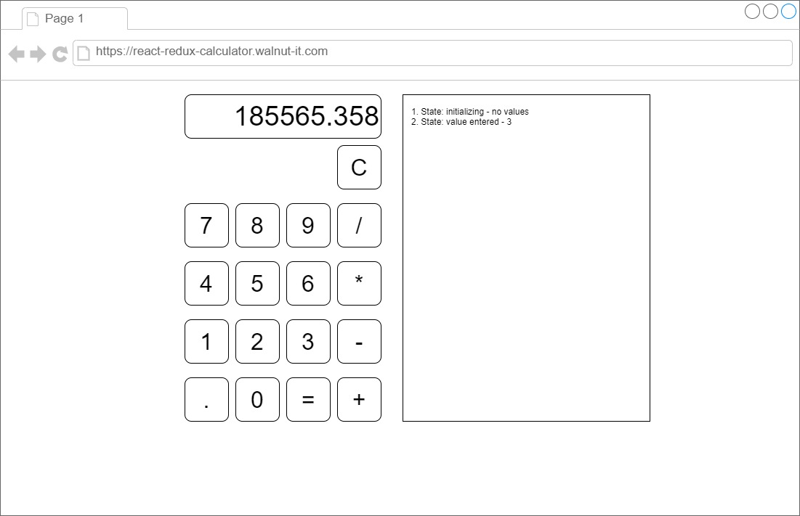
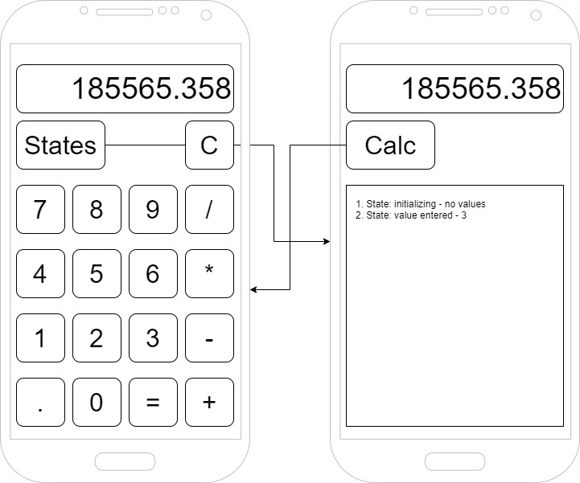
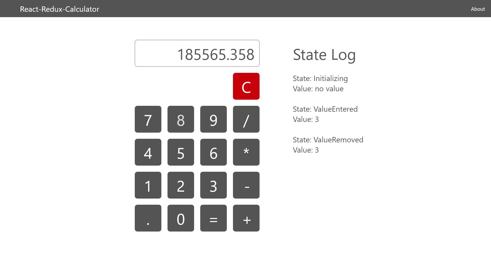

# React-Redux-Calculator

This project showcases a Calculator App developed as a practical demonstration of how React and Redux can be effectively combined to build dynamic web applications with robust state management. The project serves as an example for developers and enthusiasts eager to understand the integration of these technologies in creating responsive and maintainable applications.

## Project Overview
The Calculator App is developed to illustrate the integration of key concepts and best practices in using React and Redux together. React is utilized for building the user interface components, known for its efficiency in rendering dynamic UIs. Redux manages the application's state, ensuring that the user interface accurately reflects the current state of calculations.

## Key Features

- Basic arithmetic operations: addition, subtraction, multiplication, and division.
- Support for floating-point calculations.
- A clear and user-friendly interface with a digit input limit.
- Immediate visual feedback and dynamic display updates.
- Internationalisation (English, German and French)

## Educational and Demonstrative Objectives

The primary objective of this project is educational, providing a clear example of:

- Implementing unidirectional data flow using React and Redux.
- Systematic management of complex state changes in an application.
- Developing reusable React UI components.
- Developing a maintainable and scalable application architecture.

## Requirements
### Requirement 1: Number Input
**User Story:** 

As a user, I want to be able to enter numbers from 0 to 9 using the calculator, so that I can input the figures necessary for my calculations.

**Acceptance Criteria:**

Positive: 

- [ ] Clicking each digit button (0-9) correctly displays the digit in the input area.

Negative: 

- [ ] Input is restricted to numeric buttons only; non-numeric input should be ignored or not available.

### Requirement 2: Display of Input
**User Story:** 

As a user, I want to see the digits I've entered displayed on the calculator, so that I can confirm the numbers I am working with.

**Acceptance Criteria:**

Positive: 

- [ ] The display updates to show the current sequence of digits as they are entered, up to a maximum of 9 digits.
- [ ] Entering a number when 9 digits are already displayed should have no effect (i.e., the additional digit is ignored).

Negative: 

- [ ] The display does not allow more than 9 digits to be entered.
- [ ] The display does not show non-numeric characters or symbols not related to the calculator operations.
- [ ] The calculator remains functional and responsive even if the user attempts to enter more than 9 digits.

### Requirement 3: Basic Operations
**User Story:** 

As a user, I want to perform basic arithmetic operations (addition, subtraction, multiplication, and division) with the calculator, so that I can carry out a range of calculations.

**Acceptance Criteria:**

Positive: 

- [ ] Clicking an operation button after entering a number stores the number and sets up the calculator for the next number entry. Multiple operations can be queued before pressing equals.

Negative: 

- [ ] Operations cannot be entered consecutively without entering a number in between (e.g., "++" is invalid). The calculator does not crash or freeze when an operation button is clicked without any preceding number.

### Requirement 4: Equals Button
**User Story:** 

As a user, I want to use an equals button on the calculator to get the result of my calculation, so that I can quickly see the answer to my arithmetic operations.

**Acceptance Criteria:**

Positive: 

- [ ] Pressing equals after a valid operation sequence correctly calculates and displays the result. The calculator can handle chained operations when equals is pressed (e.g., 2 + 3 - 1).

Negative: 

- [ ] Pressing equals without a complete operation (e.g., just "5 +") does not crash the calculator and handles the scenario gracefully (e.g., does nothing or shows an error message).

### Requirement 5: Clear Functionality
**User Story:** 

As a user, I want to have a clear button on the calculator to reset my current operation, so that I can start a new calculation without manually deleting everything.

**Acceptance Criteria:**

Positive: 

- [ ] Pressing the clear button resets the current operation and clears the display. After clearing, the calculator is ready for a new operation.

Negative: 

- [ ] Pressing clear at any point resets the operation without affecting the functionality of the calculator (i.e., it does not crash or become unresponsive).

### Requirement 6: State Logging
**User Story:**

 As a developer, I want the calculator app to log each state and the value of the states, so that I can debug and understand the app's behavior during its operation.

**Acceptance Criteria:**

Positive: 

- [ ] When the screen width is less than 641 pixels, a "States" button appears in the calculator UI.
- [ ] Clicking the "States" button navigates the user to a second screen or view that displays the state logs.
- [ ] This second screen shows a log of all state changes, including actions taken and the resulting new states.
- [ ] The functionality for viewing state logs does not interfere with the calculator's primary operations and UI on larger screens.

Negative: 

- [ ] The "States" button is hidden or not present when the screen width is 641 pixels or more.
- [ ] The state log screen is easily navigable back to the main calculator interface.
- [ ] The state logs are presented in a clear, readable format, appropriate for smaller screen viewing.
- [ ] The presence of the "States" button and the state log screen does not impact the performance or responsiveness of the app.

### Requirement 7: Floating Point Input
**User Story:** 

As a user, I want to be able to enter a dot (decimal point) in the calculator, so that I can work with floating-point numbers for more precise calculations.

**Acceptance Criteria:**

Positive Cases:

- [ ] The calculator UI includes a button for the dot (decimal point).
- [ ] Clicking the dot button after entering a number appends a decimal point to the number in the display area.
- [ ] Users can enter numbers after the decimal point to create floating-point numbers.
- [ ] The calculator correctly handles calculations involving floating-point numbers.

Negative Cases:

- [ ] The calculator prevents the entry of more than one decimal point in a single number (e.g., "5.3.2" is invalid).
- [ ] The calculator does not crash or produce incorrect results when performing operations with floating-point numbers.
- [ ] If a decimal point is entered without a following digit, the calculator treats it as a trailing decimal (e.g., "5." is treated as "5.0").

### Requirement 8: Automatic Language Selection
**User Story:** 

As an international user, I want the calculator application to automatically adapt to my system's language settings, choosing between English, German, and French, so that I can use the app in my preferred language without needing to manually change settings.

**Acceptance Criteria:**

Positive Cases:

- [ ] The calculator UI automatically detects and adapts to the language set in the user's system settings, choosing from English, German, and French.
- [ ] All UI elements, including buttons and instructions, are displayed in the system's language.
- [ ] The functionality and state of the calculator remain consistent regardless of the language displayed.
- [ ] The app gracefully handles scenarios where the system language is not one of the supported languages (defaulting to English, for example).
- [ ] Negative Cases:

- [ ] Users do not have the option to manually change the language within the app.
- [ ] Language changes in the system settings are accurately reflected in the app upon the next launch or refresh.
- [ ] The calculator does not display incomplete translations or incorrect language adaptations.

## Quality Goals

| Goal          | Description                                                                |
|---------------|----------------------------------------------------------------------------|
| Reliability   | The calculations shall be always correcg                                   |
| Usability     | 1. The application is intuitively to understand by any user                | 
|               | 2. The application has an attractive UI design                             | 
| Extensibility | The application can be easily extended for new features                    |    

## Architectural Constraints
### Use of React for UI
Constraint: All user interface components must be implemented using React. This includes using JSX for templating and React components for structuring the UI.
Implication: The application's UI should be modular, with reusable components where appropriate.

### State Management with Redux
Constraint: Application state management must be handled using Redux. This includes defining actions, reducers, and utilizing the Redux store for state.
Implication: Application data flow should follow the Redux pattern of unidirectional data flow, and components should interact with the state via actions and selectors.

## Design
### Wireframe
#### Web

#### Mobile

### Final Design
#### Web

#### Mobile

*Calculator*

*States*

*About*

## Solution Strategy
The solution strategy for the React-Redux Calculator App focuses on utilizing the strengths of both React and Redux to create a responsive and state-efficient application. React's component-based architecture is employed to build a user-friendly interface, where each button and display element is a reusable component, ensuring a modular and scalable structure. Redux is integrated for state management, handling the logic of arithmetic operations and user inputs. This approach ensures a centralized and predictable state container, allowing for the consistent tracking and updating of the calculator's state. Actions and reducers in Redux define how state changes in response to user interactions, maintaining unidirectional data flow and facilitating ease of debugging and testing. The combination of React and Redux in this app exemplifies how to effectively manage UI and state in complex web applications.

## App architecure (C4 Model)
### Flow Diagrams
#### Enter a digit
#### Enter an operation
#### Enter a point
#### Calculating result
#### Clearing the application
#### Printing states

## Cross-cutting concepts
### State Management
TBD

### Routing
TBD

### I18N
TBD
